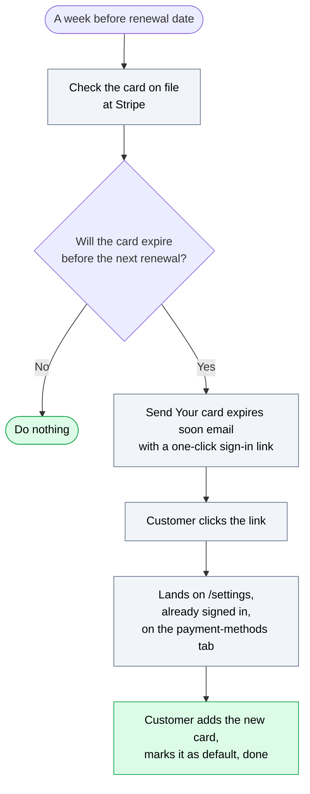

# How payment recovery works

When a customer's credit card gets declined at renewal time, this is what AchieveCE does about it. The system runs entirely on its own, every day, with no manual steps. This guide explains what's happening behind the scenes so you can answer questions from customers, build campaigns off the data it generates, and know which lever to pull when something looks off. It's written for support, marketing, and admin; engineering should be able to read it and confirm it's accurate.

If you read nothing else, read section 1 (the problem), section 3 (how a customer fixes it), and section 4 (the four contact lists). Those are the parts support and marketing need most often.

---

## 1. The problem we're solving

About one in five subscription charges at AchieveCE used to fail. That's roughly twice the SaaS average, mostly because our customer base skews toward debit cards with tight balances. The failure rate itself is hard to move because it's a feature of the audience, but what comes after the failure was something we controlled, and we were doing nothing.

Here's what changed.

| Metric | Before | Where it should be | Why we're below |
| --- | --- | --- | --- |
| Charge failure rate | 21 percent | 5 to 10 percent | Audience mix, not a tech problem |
| Recovery rate (failed charges that eventually succeed) | 14 percent | 25 to 40 percent | We weren't talking to customers when their card failed |
| Customer awareness when their card failed | Zero | Same-day notification | No emails, no in-app warning |
| Time to cancel a stuck subscription | Forever (it just stayed broken) | Controlled, after a grace period | No cleanup happened |

The payment recovery system is the layer that fills every gap in that table.

---

## 2. What a failed payment looks like

Picture a customer named Sarah. Her debit card auto-charges on the 15th of each month for her AchieveCE Premium subscription. This month her balance was low and the charge failed.

Here's her week, as a timeline.

<div class="timeline">
  <div class="timeline-day">
    <div class="timeline-day-label">Day 0<br/>morning</div>
    <div class="timeline-day-content">
      <p>Charge fails at Stripe. Within about a minute, Sarah gets the "We could not process your payment" email, a banner appears on her AchieveCE dashboard, marketing's "In dunning" Brevo list adds her, and customer support gets pinged in Slack.</p>
    </div>
  </div>
  <div class="timeline-day">
    <div class="timeline-day-label">Day 2 to 3</div>
    <div class="timeline-day-content">
      <p>Stripe quietly retries the card. It fails again. Sarah gets the second email, "Quick reminder, your payment needs attention."</p>
    </div>
  </div>
  <div class="timeline-day">
    <div class="timeline-day-label">Day 4 to 5</div>
    <div class="timeline-day-content">
      <p>Stripe retries again. Fails again. Sarah gets "Your access is at risk."</p>
    </div>
  </div>
  <div class="timeline-day">
    <div class="timeline-day-label">Day 6 to 7</div>
    <div class="timeline-day-content">
      <p>Stripe retries one last time. Fails again. Sarah gets "Final notice, access pauses tomorrow."</p>
    </div>
  </div>
  <div class="timeline-day">
    <div class="timeline-day-label">Grace period ends</div>
    <div class="timeline-day-content">
      <div class="timeline-day-branches">
        <div class="timeline-branch recovered">
          <div class="timeline-branch-title">Recovered</div>
          Stripe Smart Retries finally worked, or Sarah updated her card. She gets a "Your payment is back on track" email and the banner disappears.
        </div>
        <div class="timeline-branch failed">
          <div class="timeline-branch-title">Stripe gave up</div>
          Her subscription is canceled, she gets the "Your subscription has been paused" email.
        </div>
      </div>
    </div>
  </div>
</div>

Two things that timeline simplifies. Sarah can end the whole sequence on any day by updating her card, which charges her overdue balance on the spot (section 3). And the exact moment her access ends is set by the grace period, not a fixed day 8 (see glossary) — usually about a week in, sometimes longer.

That aside, this is the entire flow. Sarah experiences it as roughly four touchpoints over a week, all explaining the same thing in slightly more direct language each time. From our side, every step is automated, logged, and queryable.

---

## 3. How a customer fixes it

The fastest way out of a failed payment is for the customer to add or update their card in **Settings -> Payment Methods**. The moment they do, we don't wait for Stripe's next automatic retry. We charge the overdue invoice right then, on the new card.

There are two outcomes, and both tell the customer exactly what happened:

| Outcome | What the customer sees | What happens |
| --- | --- | --- |
| Charge succeeds | "Card saved and your overdue charge went through." | The new card becomes their default, the subscription goes back to active, and the past-due banner clears within moments. |
| Charge fails | "We couldn't charge your new card for the overdue balance. The card was removed, please try a different one." | The card they just entered is removed so it isn't left behind as a broken default, and they're asked to try another. |

A few things worth knowing for support:

- This immediate charge only happens through our own Settings page. If a customer fixes their card somewhere else (their bank's app, a Stripe receipt link), we fall back to Stripe's automatic retry, which can take a day or two.
- It deliberately does **not** happen at checkout. A customer buying a new course or plan won't have us quietly re-run their old failed charge against the new card.
- If the customer never comes back to fix it themselves, the daily card check (section 9) and the dunning emails still run in the background.

---

## 4. The four marketing lists

This is the part most useful to marketing day to day.

Every time something happens to a customer (card fails, payment recovers, access is paused, card is about to expire), we add or remove them from one of four contact lists inside Brevo. You can use these lists as audiences for Brevo email campaigns or sync them to Meta and Google as custom audiences for ads.

| List | Who's on it | What it's for | Stays forever? |
| --- | --- | --- | --- |
| **In dunning** | Customers whose card is failing right now | Retargeting ads with "Fix your card in 30 seconds" creative. Support outreach for high-value accounts. | No, they leave when their payment recovers or their access is revoked |
| **Card expiring soon** | Customers whose card on file expires before their next renewal | Soft retargeting, "Heads up, your card expires in a few weeks" tone. Lower urgency than dunning. | No, removed 30 days after the warning |
| **Recovered** | Customers who have ever successfully recovered from a failed payment | Lookalike audience seed for prospecting ads (these are proven resilient payers). Retention messaging like "Thanks for sticking with us." | Yes, permanent |
| **Access revoked** | Customers who have ever lost access via a payment failure | Win-back ad campaigns ("Come back to AchieveCE, here's 20 percent off"). Exclusion list for new-customer acquisition campaigns. | Yes, permanent |

The two permanent lists exist on purpose. Ad platforms build their best lookalike audiences from large historical populations, not rolling-window slices. If marketing ever needs a fresh-only view (just users who recovered in the last 90 days, for example), engineering can pull that with one query.

### How the lists stay correct

Two things keep these lists honest:

1. **Real-time updates.** The moment a customer's state changes, our code adds or removes them from the right list. Usually it happens within a few seconds.
2. **Daily reconciliation.** Every morning at 6 AM, a background job double-checks the lists against the database. If anything drifted (because Brevo was briefly down, or because someone hand-edited the list in the Brevo dashboard), the job fixes it.

If the reconciliation has to move more than 10 customers in one morning, a Slack alert posts in the payment channel. That's the signal that something upstream is failing silently and engineering should look.

**Practical implication for marketing:** do not manually add or remove people from these four lists in the Brevo dashboard. The next morning's reconciliation will undo your change. If you want to override membership for a specific customer, talk to engineering about adding them to a separate manually-curated list.

---

## 5. Hard fails versus soft fails

Every failed charge falls into one of two buckets, and the email we send depends on which one.

A **soft fail** means "the card might work next time." Common reasons: the customer's bank account was empty when we tried (they probably get paid in a few days), the bank refused for some temporary reason (often a fraud-protection auto-block that clears itself), or there was a hiccup somewhere in the chain. Stripe will keep retrying and there's a real chance it just works on its own.

A **hard fail** means "this card cannot be used as is." The card has expired, the number is wrong, or the bank has flagged it as stolen or invalid. Stripe could retry a thousand times and it would fail a thousand times. The customer has to do something for the payment to succeed.

The system reads what Stripe tells us about each failure and picks the right tone:

| Failure type | Examples | Email tone | Customer action expected |
| --- | --- | --- | --- |
| Soft | Insufficient funds, generic decline, temporary processing error | Friendly and patient: "We'll keep trying, no action needed unless you want to swap cards." | None, just wait |
| Hard | Expired card, wrong card number, stolen card flagged | Direct and clear: "Your card has expired, here's how to update it in 30 seconds." | Update the card on file |

About 80 percent of failures are soft and 20 percent are hard. The system fires a different email variant for each, so marketing maintains two versions of every dunning email in Brevo (one hard variant, one soft variant).

---

## 6. The 12 emails

There are twelve different emails the system can send. Marketing owns the visual design and copy of all of them inside Brevo. Engineering owns when each one fires.

Below is the full catalogue. Names match exactly what you'll see in the Brevo template list.

### The dunning sequence (eight emails)

These fire as Stripe retries the card. Same customer can receive any subset, depending on how many retries it takes.

| Order | Template name in Brevo | Tone | Subject line |
| --- | --- | --- | --- |
| 1 | Payment Recovery / 01 First failure, hard decline | Direct | Your card needs updating |
| 1 | Payment Recovery / 01 First failure, soft decline | Friendly | We could not process your payment |
| 2 | Payment Recovery / 02 Reminder, hard decline | Direct | Action required, please update your card |
| 2 | Payment Recovery / 02 Reminder, soft decline | Friendly | Quick reminder, your payment needs attention |
| 3 | Payment Recovery / 03 Final reminder, hard decline | Direct, urgent | Final reminder, update your card |
| 3 | Payment Recovery / 03 Final reminder, soft decline | Concerned | Your access is at risk |
| 4 | Payment Recovery / 04 Last chance, hard decline | Last call | Final notice, subscription ends tomorrow |
| 4 | Payment Recovery / 04 Last chance, soft decline | Last call | Final notice, access pauses tomorrow |

### The standalone emails (four)

These fire on specific events, not as part of a sequence.

| Template name in Brevo | When it fires | Subject line |
| --- | --- | --- |
| Payment Recovery / Card expires soon | About a week before a customer's next renewal, if their card on file will expire before that renewal | Your card expires before your next renewal |
| Payment Recovery / Payment recovered | A customer's card finally worked after one or more failures | Your payment is back on track |
| Payment Recovery / Subscription paused | We canceled the subscription because the card never recovered | Your subscription has been paused |
| Account / Sign in link | A customer requested a passwordless login link for any other reason | Your sign in link |

Each template has a small set of variable placeholders that get filled in at send time, things like the customer's first name, the amount they owe, and a one-click link to update their card. Marketing can change anything else in the template without help from engineering.

---

## 7. How Brevo plays into this

We use Brevo for two specific things and one we deliberately don't use.

**What we use Brevo for**

Email templates are stored in the Brevo dashboard. Marketing maintains the visual design, the wording, and any tweaks. Updating an email template doesn't require an engineering deploy or even an engineer in the loop. You go to Brevo, open the template, change what you want, save. The next email sent through that template uses your new version.

Contact lists are stored in Brevo too. The four lists from section 4 live in a folder called "Subscription Management" in the Brevo dashboard. Marketing can browse them, use them as audiences inside Brevo, or sync them out to Meta and Google.

Brevo also handles the actual mechanics of sending: deliverability, bounce handling, unsubscribe links, the SMTP plumbing. We never think about any of that.

**What we don't use Brevo for**

Brevo has a feature called "Automations" or "Workflows" where you can build flow charts inside Brevo that say "when X event happens, send Y email." We tried that and removed it. The reason: Brevo's automation builder had a setting where event data could fail to pass through to the email template, and four out of twelve of our automations had that setting wrong. Customers got emails with blank spaces where their name should be. Hard to debug from Brevo's side.

Now our backend code decides when each email goes out and calls Brevo's email-sending API directly. The template name and the variables travel together in the same call, so they can't get separated. Marketing doesn't lose anything from this change because the templates themselves are still in Brevo and still editable there. Marketing just doesn't see the "send" step as a Brevo workflow.

<div class="comparison">
  <div class="comparison-card removed">
    <div class="comparison-card-header">Removed</div>
    <ol>
      <li>Our code fires event to Brevo.</li>
      <li>Brevo automation catches the event.</li>
      <li>Brevo automation picks a template.</li>
      <li>Brevo sends the email.</li>
    </ol>
  </div>
  <div class="comparison-card current">
    <div class="comparison-card-header">Current</div>
    <ol>
      <li>Our code calls Brevo's send API directly with template ID and data.</li>
      <li>Brevo sends the email.</li>
    </ol>
  </div>
</div>

---

## 8. The "card expires soon" flow

Most subscription cancellations don't happen because someone deliberately cancels. They happen because the card on file silently expires and the next charge fails. We try to head this off about a week in advance.

Here's how it works:



The one-click sign-in link is a "magic link" (a temporary URL that signs the customer in). It expires after an hour for security, and if a customer clicks an expired link, they land on the regular sign-in page with their email already filled in and a small banner explaining what happened. This particular email carries the link only, no code (the code-plus-link version is for our general sign-in email; see the glossary).

The customer's email address is added to the **Card expiring soon** list at this moment. Marketing can use that list for retargeting ads, but the urgency is genuinely lower than the dunning audience, so the creative should be softer.

---

## 9. When we fix the card for them

The "card expires soon" email in section 8 assumes the customer has to act. Often they don't. If a customer has more than one card saved and the one set as default is the one about to expire, a daily check quietly promotes a still-valid card to default before the renewal. No email, no action needed, and the renewal then charges the good card instead of failing.

It runs every morning. For each customer with a saved default card and an active subscription, it asks one question: will the default card be expired by the next charge? If yes, and there's another valid card on file, it swaps. If there's no valid backup, it leaves things alone, and the "card expires soon" email does the nudging instead.

The swap and the email run independently, so they don't suppress each other. In practice, a customer with a good backup card usually gets swapped before the email would ever matter; a customer without one gets the email.

Two related bits of automatic housekeeping:

- **Card networks tell us about replacements.** When Visa or Mastercard issues a customer a new card number to replace an old one, Stripe passes that update through and we apply it automatically. The customer never has to re-enter anything, and we don't email them about it.
- **Deleting the default promotes another.** If a customer removes the card that happens to be their default and they still have others on file, we immediately promote one of the remaining cards, so they're never left without a default.

---

## 10. The in-app banner

When a customer's last payment has failed, they see this on top of every page of their AchieveCE dashboard:

```
+---------------------------------------------------------+
| (!) We couldn't process your last payment               |
|     AchieveCE Premium                                   |
|     Access ends in   03 Days  11 Hours  52 Min  08 Sec  |
|                                                         |
|     [ Update payment method ]                           |
+---------------------------------------------------------+
```

The banner shows a live countdown to the moment access ends (the grace period, see glossary) and it is **not dismissible**. We keep it that way on purpose: the worst outcome here is a customer losing access without realizing it, so we don't give them a way to hide the warning. Clicking "Update payment method" takes them to **Settings -> Payment Methods**, where adding a card charges the overdue balance immediately (section 3).

Once access has actually been revoked, that yellow banner is replaced by a separate red one for about 60 days. It points the customer to the certificates they already earned (nothing is deleted when a subscription is paused) and, unlike the past-due banner, it can be dismissed.

---

## 11. Where customers manage their cards

The canonical place is **Settings -> Payment Methods**. Here's what's on that page:

- A list of every saved card (last four digits, brand, expiry date)
- A red "Expired" badge on cards that have passed their expiry month
- An amber "Expires soon" badge on cards expiring within 60 days
- A red banner at the top of the section when the default card is expired (because next renewal will fail)
- An amber banner at the top when any card is about to expire
- A "Set as default" button on every non-default card
- A "Delete" button on every card (with protection: we won't let them delete their last card if they have an active subscription)
- An "Add new card" button that opens a Stripe-secured form, with a "Make this my default payment method" checkbox if they already have other cards

This is where every email's main button (and the banner's main button) points. There was briefly a separate /dashboard/billing page that did roughly the same thing; we removed it and now any old links to /dashboard/billing automatically forward to the settings page.

---

## 12. Common questions from customers

### "I got a 'payment failed' email but I haven't done anything different."

This is the most common email-related ticket. Tell them: their card was declined by their bank at our last automatic renewal attempt. We don't know exactly why, only that the bank said no. The most common reasons are an empty account on the day we charged, a fraud-protection auto-block (banks sometimes flag subscription charges as suspicious), or an expired card.

Action: send them to **Settings -> Payment Methods**. If the card looks valid there, suggest they call their bank. If the card is expired (red badge), they need to add a new one.

### "I just updated my card but I still see the banner."

If they updated it on our **Settings -> Payment Methods** page, the overdue charge is attempted right away and the banner should clear within a moment. Tell them to refresh. If it didn't clear, one of two things happened: the charge failed (we would have removed that card and shown a message, so they should try a different card), or they updated the card somewhere other than our app. In that second case Stripe's automatic retry can take a day or two. Either way, confirm in Settings that a valid, unexpired card is set as default.

### "My access was cut off but I never got any emails."

Two things to check:

1. Open Brevo and search for that customer's email. Look at their Activity log. If our emails are listed there with status "Sent," the problem is on the customer's side (Gmail filter, blocked, spam folder). If they're listed with status "Bounced" or "Hard bounce," their email address is invalid or unreachable.
2. If Brevo shows nothing, escalate to engineering. That means our system didn't try to send the emails, which is a bug.

### "I want to come back, can I just restart?"

Yes. They sign in, go to the courses they were interested in, and start a new subscription. Their course progress and any certificates they already earned are safe; nothing was deleted when the subscription was paused.

If their old subscription was still stuck in a failed state when they buy again, the system cleans it up automatically: it cancels the stuck one so they're never billed for both, and counts them as a recovered customer.

Note for marketing: this customer is in the **Access revoked** list. If they restart, they stay in that list (it's a historical record), but they may also re-enter **In dunning** later if they have payment trouble again. The lists can overlap.

---

## 13. What marketing can do with this

A few starting points, not a playbook.

**Win-back the Access revoked list.** Customers who subscribed once and lost access. Useful as a custom audience for win-back campaigns.

**Lookalike audience seeded on the Recovered list.** These customers stuck with us through a payment problem. Combined with other CRM data, they can seed a strong lookalike for prospecting.

---

## 14. Glossary

| Term | What it means here |
| --- | --- |
| **Dunning** | The process of asking a customer to settle an overdue payment. The four emails in the dunning sequence are our dunning emails. |
| **Past due** | A subscription whose last renewal charge failed but who still has access while we try to recover the payment. The grace window. |
| **Grace period** | The window a customer keeps access after a failed charge while we try to recover the payment. It's set the first time the charge fails, to just after Stripe's next scheduled retry, or 21 days if Stripe doesn't give us a retry date, and then held fixed so the deadline doesn't move. The in-app banner counts down to it. |
| **Hard decline** | A card failure that won't recover with retries; the card needs to be replaced. |
| **Soft decline** | A card failure that might recover with retries; the card itself is fine. |
| **Smart Retries** | Stripe's automatic retry feature. It tries failed charges again at intervals it thinks are more likely to succeed. We don't manage retry timing ourselves. |
| **Card auto-swap** | A daily check that promotes a valid saved card to default when the current default is about to expire, so the renewal doesn't fail. Silent, no email. See section 9. |
| **Network Updates** | Stripe's back-channel where card networks (Visa, Mastercard) automatically tell Stripe when a customer gets a new card. We apply these silently; about 260 charges in any 90-day window are saved this way without anyone realizing. |
| **Magic link** | A one-time sign-in URL we email to customers. They click it, land signed in, no password needed. Expires after an hour. The "card expires soon" email uses a link only; our general sign-in email includes both the link and a 6-digit code (see OTP). |
| **OTP** | A 6-digit one-time code included in our general sign-in email as an alternative to the magic link. The customer types it in instead of clicking. Expires after an hour, the same as the link. |
| **Brevo** | The email platform we use. Stores templates, sends emails, hosts our contact lists. |

---

If anything in this guide is wrong, outdated, or unclear, file an issue in the achievece-docs repository or ping the team. This document is meant to stay accurate, and the fastest way to keep it that way is to flag problems early.
